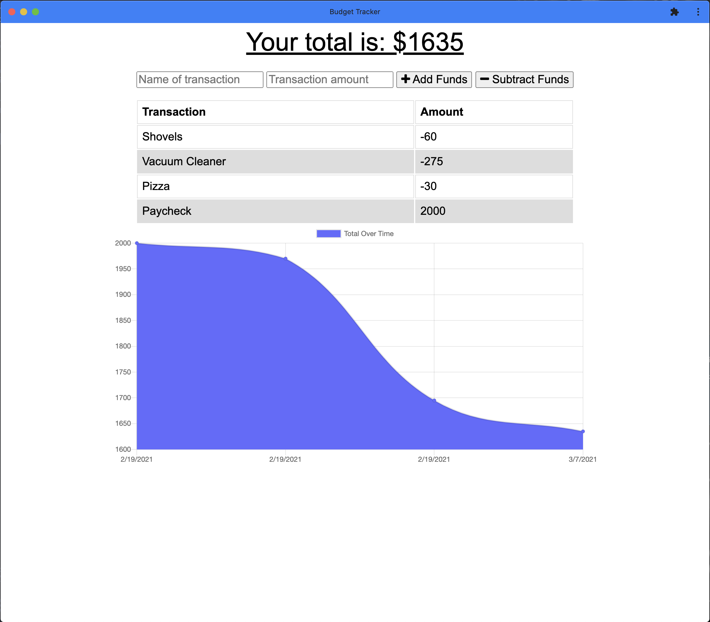

# Offline-Budget

    

## Description

Offline-Budget is a pre-built budget application, for which I was tasked with turning into a progressive web app. Utilizing a manifest.json file, the application can be downloaded as a mobile app. As the name suggests, this application is functional without an internet connection via a service worker, which catches https requests and responds with cached files if offline. 

## Table of Contents:
* [Link](#Link)
* [Installation](#Installation)
* [Usage](#Usage)
* [Screenshot](#Screenshot)
* [Credits](#Credits)

## Link

[Link to deployed application](https://shrouded-dawn-82555.herokuapp.com/)

## Installation 

To contribute to development, Node.js and MongoDb must be installed on your local machine. The application is deployed to Heroku and the database is hosted on MongoDb Atlas. 

## Usage 

Use this application to keep track of your budget, on your phone, regardless of internet connection or speed. Rest assured, after you reconnect, all of your transactions will be backed up in the database. 

## Screenshot

      

## Credits

UT Austin Coding Bootcamp

## License 

MIT
